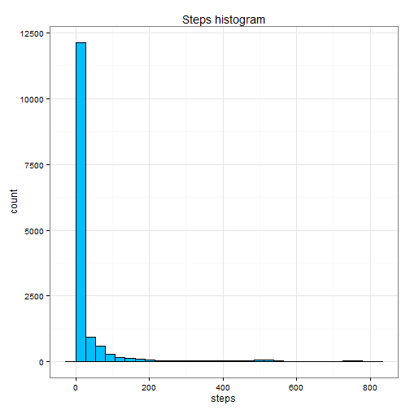
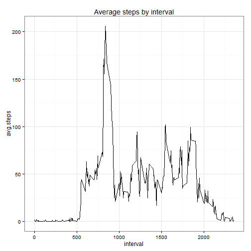
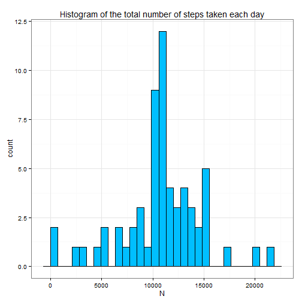
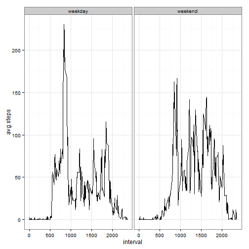

```r
# Reproducible research
# Course project 1


# 0. Load packages

library(dplyr)
library(tidyr)
library(ggplot2)
library(lubridate)
library(class)

md <- read.csv('activity.csv') %>% mutate(date = ymd(date)) %>% arrange(interval)
```


# 1. What is mean total number of steps taken per day?


```r
ggplot(md, aes(steps)) + 
  geom_histogram(fill = 'deepskyblue', colour = 'black') + 
  theme_bw() +
  ggtitle('Steps histogram')
```

```
## stat_bin: binwidth defaulted to range/30. Use 'binwidth = x' to adjust this.
```

 

```r
mean(md$steps, na.rm = T)
```

```
## [1] 37.3826
```

```r
median(md$steps, na.rm = T)
```

```
## [1] 0
```


# 2.What is the average daily activity pattern?


```r
md.auxiliar <- md %>% group_by(interval) %>% summarise(avg.steps = mean(steps, na.rm = T))

ggplot(md.auxiliar, aes(interval, avg.steps)) + 
geom_line() +
theme_bw() +
ggtitle('Average steps by interval')
```

 

The 5-minute interval which contains the maximum number of steps is: 835

# 3. Imputing missing values

The total number of missing values in the dataset is: 2304 


```r
md.auxiliar <- md %>% group_by(interval) %>% summarise(steps = round(mean(steps, na.rm = T)))

md.complete <- md[complete.cases(md),]
md.uncomplete <- md[!complete.cases(md),] %>% select(-steps)
md.uncomplete <- left_join(md.uncomplete, md.auxiliar)
```

```
## Joining by: "interval"
```

```r
md.filled <- bind_rows(md.complete, md.uncomplete) %>% arrange(interval)

md.auxiliar_2 <- md.filled %>% group_by(date) %>% summarise(N = sum(steps))

ggplot(md.auxiliar_2, aes(x = N)) + 
geom_histogram(fill = 'deepskyblue', colour = 'black') + 
ggtitle('Histogram of the total number of steps taken each day')+
theme_bw()
```

```
## stat_bin: binwidth defaulted to range/30. Use 'binwidth = x' to adjust this.
```

 

```r
mean(md.auxiliar_2$N)
```

```
## [1] 10765.64
```

```r
median(md.auxiliar_2$N)
```

```
## [1] 10762
```

### What is the impact of imputing missing data on the estimates of the total daily number of steps?


## 4. Are there differences in activity patterns between weekdays and weekends?


```r
md.filled <- md.filled %>% mutate(wd = weekdays(date)) 

# passing from spanish weekdays names to english

weekend <- function(x){
  res <- rep('weekday', length(x))
  res[which(x %in% c('Saturday', 'Sunday'))] = 'weekend'
  res <- as.factor(res)
  return(res)
}

md.filled$wd <- factor(md.filled$wd, levels = c('lunes', 'martes', 'miércoles','jueves','viernes','sábado','domingo'), labels = c('Monday','Tuesday', 'Wednesday','Thursday','Friday', 'Saturday', 'Sunday'))

md.filled$wd <- weekend(md.filled$wd)
md.auxiliar_3 <- md.filled %>% group_by(interval, wd) %>% summarise(avg.steps = mean(steps))

ggplot(md.auxiliar_3, aes(x = interval, y = avg.steps)) +
geom_line() + 
facet_wrap(~wd) +
theme_bw()
```

 

